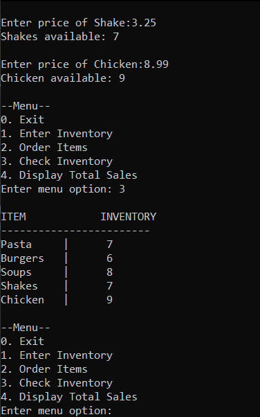
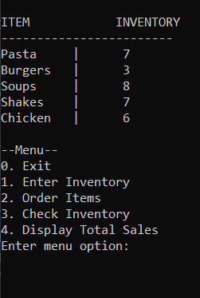
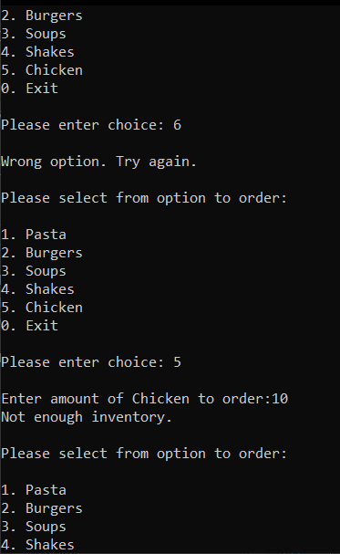
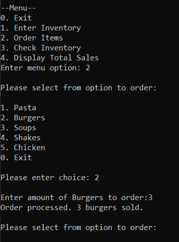
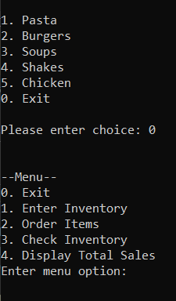
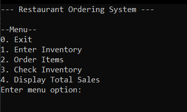
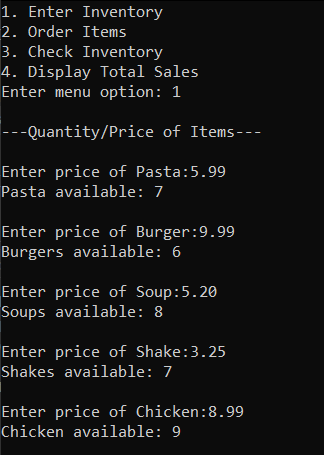
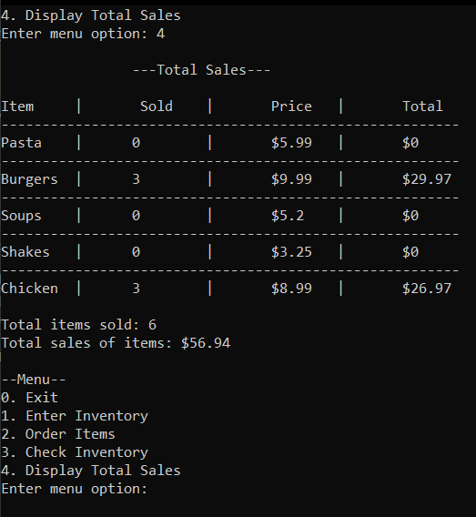

# Restaurant Ordering System

This console application allows users to enter the number and price of pre-determined items, order items, and view inventory and sales.

**Why:**
I created this to practice C++. Initially, I started with a Hotel Management System tutorial but made it an ordering/inventory system for a restaurant. 

**Functions:**
 
Display Inventory function ( displayItems() )

    * The function takes in the initial inventory - ordered inventory through the currInventory function. This is later converted to a string. Converting the values to a string isn’t necessary, but I wanted to try the function out.

    * Parameters:

        * Just lowercase: sold inventory (ex: sPasta)

        * Lower & upper: initial quantity (ex: qPasta)

    
    

Order Items function ( orderItems() )

    * Parameters same as displayInventory() with added option variable (referenced)

    * I separated the options’ if- statements by putting them into their own function leaving out the “break” statement. This was done for less code in main().

    * Users can pick an item from the list to order, and input the amount they want. 

        * The user’s input is subtracted from the item’s inventory to check for stock limits. If the difference enters the negatives, users are given a “Not enough stock” statement and are returned to the menu.
        

        * If the difference is equal to or greater than 0, they get an “Order processed” statement with the amount they ordered. Also, the amount is returned to be used in currInventory().
        

    * Once done, users can press “0” to exit the order menu to go back to the original menu.
    

Current Inventory function ( currInventory() )

    * Simple function that subtracts sold inventory from initial inventory

    * Parameters are referenced so as to not type each variable into separate problems

    * Used in displayInventory()

# Other Screenshots

**Setting inventory and prices*

**Displays total sales with amounts sold*

